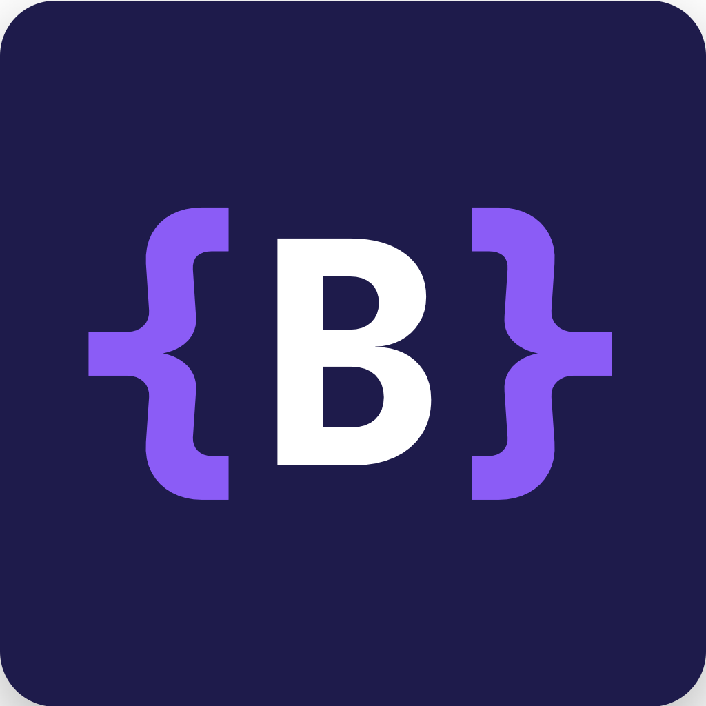

# BANCS - Professional Homepage & Blog



Professional software development company homepage and technical blog, built with VitePress, TypeScript, and Tailwind CSS.

🌐 **Live Site**: [www.bancs.no](https://www.bancs.no)

## Features

- ⚡️ **Fast & Modern**: Built with VitePress for optimal performance
- 🎨 **Beautiful Design**: Custom Tailwind CSS theme with BANCS brand colors
- 🌓 **Dark/Light Mode**: Seamless theme switching
- 📝 **Technical Blog**: Share knowledge with code examples
- 🔧 **TypeScript**: Full type safety throughout
- 📦 **Semantic Versioning**: Automated releases with semantic-release
- 🚀 **GitHub Pages**: Automated deployment via GitHub Actions
- 🤝 **Open Source**: Accept guest blogger contributions via PRs

## Tech Stack

- **Framework**: [VitePress](https://vitepress.dev) v1.x
- **Language**: TypeScript 5.x
- **Styling**: Tailwind CSS 4.x
- **Deployment**: GitHub Pages
- **CI/CD**: GitHub Actions
- **Versioning**: Semantic Release

## Project Structure

```
pages/
├── docs/                      # VitePress docs & content
│   ├── .vitepress/           # VitePress configuration
│   │   ├── config.ts         # Main config
│   │   └── theme/            # Custom theme
│   │       ├── index.ts      # Theme entry
│   │       └── custom.css    # Tailwind + custom styles
│   ├── public/               # Static assets
│   │   ├── bancs.png         # Logo
│   │   └── CNAME             # Custom domain
│   ├── blog/                 # Blog posts
│   │   ├── index.md          # Blog index
│   │   └── *.md              # Individual posts
│   ├── index.md              # Homepage
│   ├── about.md              # About page
│   ├── projects.md           # Projects showcase
│   └── contact.md            # Contact information
├── examples/                  # Code examples for blog posts
│   └── working-with-claude/  # Example directory
├── .github/workflows/         # GitHub Actions
│   ├── deploy.yml            # Pages deployment
│   └── release.yml           # Semantic release
├── tailwind.config.js        # Tailwind configuration
├── postcss.config.js         # PostCSS configuration
└── package.json              # Dependencies & scripts
```

## Getting Started

### Prerequisites

- Node.js 22+ (LTS)
- npm 10+

### Installation

```bash
# Clone the repository
git clone https://github.com/BANCS-Norway/home.git
cd pages

# Install dependencies
npm install

# Start development server
npm run dev
```

The site will be available at `http://localhost:5173`

### Development

```bash
# Start dev server with hot reload
npm run dev

# Build for production
npm run build

# Preview production build
npm run preview
```

## Contributing

We welcome contributions, especially guest blog posts!

- See [CONTRIBUTING.md](./CONTRIBUTING.md) for contribution guidelines
- Read our [Code of Conduct](./CODE_OF_CONDUCT.md) for community standards

### Writing a Guest Blog Post

1. **Fork the repository** at https://github.com/BANCS-Norway/home
2. **Create your blog post**:
   - Add your post: `docs/blog/your-post-title.md`
   - Add code examples: `examples/your-post-title/`
3. **Follow the format**:
   ```md
   # Your Post Title

   **Published**: YYYY-MM-DD
   **Author**: Your Name
   **Reading Time**: X minutes

   ## Introduction
   Your content here...
   ```
4. **Submit a PR** with your changes

## Design System

BANCS uses a custom color palette based on our brand:

```css
--bancs-dark: #0f172a       /* Primary dark background */
--bancs-dark-alt: #1e1b4b   /* Alternative dark */
--bancs-accent: #6366f1     /* Indigo accent */
--bancs-accent-alt: #8b5cf6 /* Purple accent */
```

See [../design/](../design/) for complete brand guidelines.

## Deployment

### GitHub Pages

The site automatically deploys to GitHub Pages on every push to `main`:

1. GitHub Actions builds the site
2. Deploys to `gh-pages` branch
3. Available at custom domain via CNAME

### Custom Domain Setup

1. Add `CNAME` file in `docs/public/` with your domain
2. Configure DNS records:
   ```
   CNAME www -> bancs.github.io
   A @ -> GitHub Pages IPs
   ```
3. Enable HTTPS in repository settings

## Versioning

This project uses [Semantic Release](https://semantic-release.gitbook.io/) for automated versioning:

- **feat**: New feature → Minor version bump
- **fix**: Bug fix → Patch version bump
- **BREAKING CHANGE**: Breaking change → Major version bump

Commits must follow [Conventional Commits](https://www.conventionalcommits.org/):

```bash
git commit -m "feat: add new blog post about TypeScript"
git commit -m "fix: correct typo in about page"
git commit -m "docs: update contributing guidelines"
```

## Scripts

| Script | Description |
|--------|-------------|
| `npm run dev` | Start development server |
| `npm run build` | Build for production |
| `npm run preview` | Preview production build |
| `npm run semantic-release` | Run semantic release (CI only) |

## License

MIT © BANCS

See [LICENSE](./LICENSE) for details.

## Contact

- **Website**: [www.bancs.no](https://www.bancs.no)
- **Email**: contact@bancs.no
- **GitHub**: [@BANCS-Norway](https://github.com/BANCS-Norway)
- **LinkedIn**: [Benny Thomas](https://linkedin.com/in/virtueme)

## Acknowledgments

- Built with [VitePress](https://vitepress.dev)
- Styled with [Tailwind CSS](https://tailwindcss.com)
- Deployed on [GitHub Pages](https://pages.github.com)
- Logo design: See [../design/DESIGN-CONCEPT.md](../design/DESIGN-CONCEPT.md)
- Site development assisted by [Claude](https://claude.ai) by Anthropic

---

**Built with ❤️ by BANCS**
